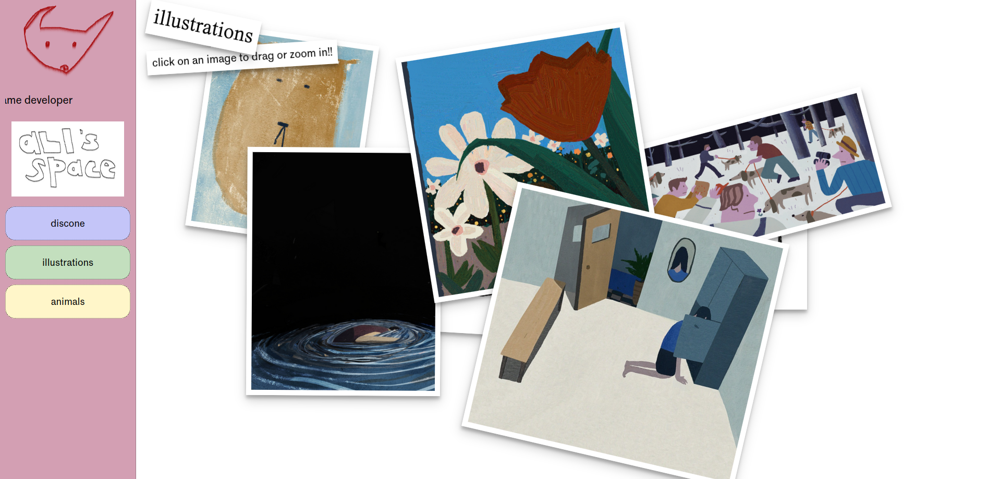

Portfolio Website for Ali Lim
==================

Ali is an illustrator and game designer.

In mid-2023, they were looking for a redesign of their portfolio website that reflected their growth as an artist as well as their development into a game designer.

I delivered a turnkey project, both redesigning and coding the site. I designed a visual identity that matched the style and tone of their art and their games, as well as showcased their art i:w
n a more playful space. 

The final design features a skeumorphic "pile" of draggable frames as well as web elements inspired by the old web and the handmade web.

[Click through here for the full website.](https://alilim.com)

Built with native HTML/CSS/JS, Handlebars, and Grunt.js.

